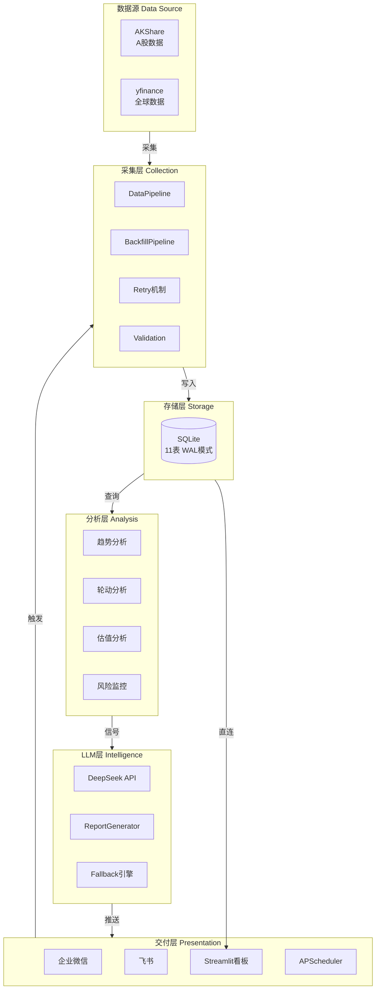
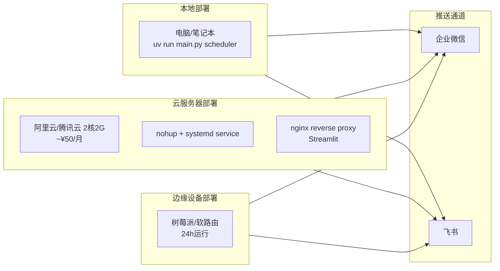

# Fund-Advisor

[](https://www.python.org/)
[](LICENSE)
[](https://github.com/astral-sh/uv)

> 个人基金/ETF 智能投顾系统 — A股 + 全球市场，自动化数据采集、量化分析、LLM日报生成、多渠道推送、Web看板。

---

## 系统架构



> 更详细的交互式架构图: [`docs/architecture.html`](docs/architecture.html)

---

## 功能特性

### 数据采集 (Data Layer)
- **A股数据** — 通过 AKShare 采集 2000+ ETF 实时行情、5大指数、行业排名、北向资金、主力资金、PE/PB 估值、财经新闻
- **全球数据** — 通过 yfinance 采集 10 大 US ETF、全球指数、VIX、USD/CNY、美债收益率
- **宏观数据** — 中国10年国债收益率、CPI、GDP、PMI（Phase 1 新增）
- **历史回填** — `BackfillPipeline` 支持增量历史数据下载，A股 `stock_zh_a_hist` + 全球 `Ticker.history(5y)`
- **数据验证** — 价格非负检查、涨跌幅边界验证、时间新鲜度检测，坏数据标记但不阻断
- **重试机制** — 指数退避重试（1s/2s/4s + jitter），429/503 自动恢复

### 量化分析 (Analysis Engine)
- **趋势分析** — MA 多头排列/空头排列/交叉震荡检测、站立线比率、VIX 情绪评分
- **行业轮动** — 1月/3月/6月加权动量排名、资金流向分析、美林时钟经济周期映射
- **估值判断** — PE 历史分位、股债利差、ETF 溢价/折价预警
- **风险监控** — 异常波动检测(>3%)、最大回撤、相关性矩阵
- **历史数据驱动** — 分析引擎自动从 SQLite 查询历史价格序列，MA/回撤/相关性指标基于真实历史数据计算

### LLM 日报生成
- **6段式结构** — 今日概览 → 方向信号 → 板块机会 → 估值温度 → 风险提醒 → 持仓建议
- **结构化输出** — 即将支持 Pydantic 模型验证的 JSON 输出（Phase 2 规划）
- **回退机制** — LLM 失败时自动切换规则引擎生成确定性报告
- **成本控制** — DeepSeek API 单次成本约 ¥0.002

### 推送与看板
- **企业微信** — Webhook 推送日报和预警
- **飞书** — Webhook 推送日报和预警
- **Streamlit 看板** — 5页实时仪表盘：ETF排行榜、行业热力图、持仓收益、日报回顾、手动触发
- **定时调度** — APScheduler：交易日15:30自动采集+生成+推送，盘中每5分钟异常监控

---

## 快速开始

### 1. 安装依赖

```bash
git clone <repo-url> && cd fund-advisor
uv sync
```

### 2. 配置环境变量

```bash
export DEEPSEEK_API_KEY=sk-xxx           # LLM日报生成(必填)
export WECHAT_WORK_WEBHOOK_URL=https://qyapi.weixin.qq.com/cgi-bin/webhook/send?key=xxx  # 可选
export FEISHU_WEBHOOK_URL=https://open.feishu.cn/open-apis/bot/v2/hook/xxx               # 可选
```

### 3. 初始化历史数据（推荐）

```bash
uv run python -c "
from src.data.pipeline import BackfillPipeline
from src.data.collectors.akshare_collector import AKShareCollector
from src.data.collectors.yfinance_collector import YFinanceCollector
from src.data.storage import MarketDB
from src.config import AppConfig

cfg = AppConfig.load('config/config.yaml')
db = MarketDB(cfg.data.db_path)
ak = AKShareCollector()
yf = YFinanceCollector()
bp = BackfillPipeline(ak, yf, db, cfg)
bp.run_backfill(days=365)
print('历史数据回填完成')
"
```

### 4. 运行

**一次性完整流程：**
```bash
uv run python main.py once
```

**定时调度（后台运行）：**
```bash
uv run python main.py scheduler
```

**Web 看板：**
```bash
uv run streamlit run app.py
```

---

## 配置详解

### `config/config.yaml`

```yaml
# 数据层配置
data:
  db_path: "data/fund_advisor.db"
  sources:
    akshare:
      enabled: true
      rate_limit_seconds: 1.0
    yfinance:
      enabled: true
      rate_limit_seconds: 0.5

# 分析引擎配置
analysis:
  trend:
    ma_periods: [5, 20, 60]           # 短期/中期/长期均线
    standing_line_threshold: 0.5       # 站立线阈值
  rotation:
    momentum_windows: [21, 63, 126]    # 1月/3月/6月动量窗口
  valuation:
    pe_percentile_low: 30              # PE分位低估线
    pe_percentile_high: 70             # PE分位高估线
  risk:
    anomaly_threshold: 0.03            # 异常波动阈值(3%)
    max_drawdown_warning: 0.15         # 回撤预警阈值(15%)
    correlation_warning: 0.8           # 相关性预警阈值(0.8)

# LLM配置
llm:
  provider: deepseek                   # deepseek / openai / ollama
  model: deepseek-chat
  base_url: "https://api.deepseek.com/v1"
  temperature: 0.7
  max_tokens: 2048

# 推送配置
notify:
  wechat_work:
    enabled: false
    webhook_url_env: WECHAT_WORK_WEBHOOK_URL
  feishu:
    enabled: false
    webhook_url_env: FEISHU_WEBHOOK_URL

# 调度配置
scheduler:
  timezone: "Asia/Shanghai"
  jobs:
    daily_collection:
      cron: "30 15 * * mon-fri"        # 交易日 15:30
    intraday_monitor:
      interval_minutes: 5              # 盘中每5分钟
      market_hours: "09:30-15:00"

# 日志配置
logging:
  level: INFO
  file: "data/logs/fund_advisor.log"
```

### `portfolio.yaml` — 持仓管理

```yaml
holdings:
  - code: "510300"
    name: "沪深300ETF"
    market: "a_share"
    cost_basis: 3.85
    shares: 5000
    category: "broad"

  - code: "588000"
    name: "科创50ETF"
    market: "a_share"
    cost_basis: 1.02
    shares: 10000
    category: "broad"

  - code: "513100"
    name: "纳斯达克ETF"
    market: "us"
    cost_basis: 5.2
    shares: 2000
    category: "overseas"

  - code: "QQQ"
    name: "纳指100"
    market: "us"
    cost_basis: 420.0
    shares: 50
    category: "overseas"

  - code: "511880"
    name: "银华日利"
    market: "a_share"
    cost_basis: 100.0
    shares: 1000
    category: "bond"

categories:
  broad: "宽基指数"
  sector: "行业指数"
  theme: "主题指数"
  overseas: "海外指数"
  bond: "债券/货币"
```

---

## 技术指标说明

### 趋势指标

| 指标 | 计算方法 | 用途 |
|------|---------|------|
| **MA排列** | SMA(5) vs SMA(20) vs SMA(60) | 判断短期/中期/长期趋势方向 |
| **站立线比率** | 上涨ETF数量 / 总ETF数量 | 市场广度指标，判断上涨普遍性 |
| **情绪评分** | VIX线性映射(15-25) ± 涨跌比调整 | 恐慌/贪婪/中性三态判断 |

### 轮动指标

| 指标 | 计算方法 | 用途 |
|------|---------|------|
| **动量排名** | 0.2×1月 + 0.3×3月 + 0.5×6月收益率 | 找出相对强势板块 |
| **资金流向** | 北向资金 + 主力资金总和 | 判断大资金进出方向 |
| **经济周期** | CPI + GDP → 美林时钟四象限 | 宏观配置参考 |

### 估值指标

| 指标 | 计算方法 | 用途 |
|------|---------|------|
| **PE分位** | 当前PE在历史PE中的排名百分位 | 判断市场整体贵贱 |
| **股债利差** | 1/PE - 10年国债收益率 | 股权风险溢价，越大越值得买 |
| **ETF溢价** | (净值-市价)/净值 | 套利和交易风险预警 |

### 风险指标

| 指标 | 计算方法 | 阈值 | 用途 |
|------|---------|------|------|
| **异常波动** | 单日涨跌幅绝对值 | >3% | 捕捉突发事件 |
| **最大回撤** | (峰值-当前)/峰值 | >15% | 趋势下行预警 |
| **平均相关性** | ETF间Pearson相关系数均值 | >0.8 | 分散化失效预警 |

---

## 数据模型

### SQLite 表结构 (11张表)

| 表名 | 数据 | 用途 |
|------|------|------|
| `etf_daily` | 2000+ A股ETF 日行情 | 实时排名、波动检测 |
| `index_daily` | 5大A股指数 + 全球指数 | 趋势判断、概览 |
| `sector_daily` | 行业板块排名 | 轮动分析 |
| `fund_flow_daily` | 北向资金 + 主力资金 | 资金流向 |
| `news_daily` | 财经新闻标题 | 消息面参考 |
| `macro_daily` | VIX/美债/汇率/中国宏观 | 估值和周期判断 |
| `etf_history` | ETF 历史 OHLCV | MA/回撤计算 *(Phase 1 新增)* |
| `index_history` | 指数历史 OHLCV | 趋势分析 *(Phase 1 新增)* |
| `valuation_daily` | PE/PB 历史序列 | 分位计算 |
| `reports` | LLM 生成的日报 | 历史回顾 |
| `alerts` | 风险预警记录 | 预警追踪 |

---

## 部署架构



### 云服务器部署（推荐）

```bash
# 1. 上传代码
scp -r fund-advisor/ user@server:~/
ssh user@server

# 2. 安装依赖
cd fund-advisor && uv sync

# 3. 配置环境变量
export DEEPSEEK_API_KEY=sk-xxx
export WECHAT_WORK_WEBHOOK_URL=...

# 4. 初始化历史数据
uv run python -c "from src.data.pipeline import BackfillPipeline; ...; bp.run_backfill(365)"

# 5. 启动调度（后台）
nohup uv run python main.py scheduler > data/logs/scheduler.log 2>&1 &

# 6. 启动Web看板（可选，配合nginx）
nohup uv run streamlit run app.py --server.port 8501 > data/logs/streamlit.log 2>&1 &
```

### systemd 服务配置

创建 `/etc/systemd/system/fund-advisor.service`:

```ini
[Unit]
Description=Fund Advisor Scheduler
After=network.target

[Service]
Type=simple
User=ubuntu
WorkingDirectory=/home/ubuntu/fund-advisor
ExecStart=/usr/local/bin/uv run python main.py scheduler
Restart=always
RestartSec=10
Environment=DEEPSEEK_API_KEY=sk-xxx
Environment=WECHAT_WORK_WEBHOOK_URL=https://...

[Install]
WantedBy=multi-user.target
```

```bash
sudo systemctl enable fund-advisor
sudo systemctl start fund-advisor
sudo systemctl status fund-advisor
```

---

## 项目结构

```
fund-advisor/
├── main.py                              # 入口: once | scheduler | backfill
├── app.py                               # Streamlit Web看板 (5页)
├── pyproject.toml                       # uv 依赖 + 构建配置
├── uv.lock                              # 锁定依赖版本
│
├── config/
│   └── config.yaml                      # 系统配置
├── portfolio.yaml                       # 持仓配置
├── data/                                # SQLite + 日志
│   └── fund_advisor.db                  # 主数据库 (11表, WAL模式)
│
├── docs/
│   ├── architecture.html                # 交互式架构图 (SVG)
│   └── superpowers/specs/               # 设计文档
│
└── src/
    ├── config.py                        # Pydantic 配置模型
    │
    ├── data/                            # 数据层
    │   ├── models.py                    # 17个dataclass + Pydantic验证模型
    │   ├── storage.py                   # SQLite存储 (11表, executemany批量写入)
    │   ├── portfolio.py                 # YAML持仓读取
    │   ├── pipeline.py                  # DataPipeline + BackfillPipeline
    │   ├── validation.py                # 数据验证层 *(Phase 1 新增)*
    │   └── collectors/
    │       ├── retry.py                 # 指数退避重试 *(Phase 1 新增)*
    │       ├── akshare_collector.py     # A股数据采集 (12个端点)
    │       └── yfinance_collector.py    # 全球数据采集 (async化)
    │
    ├── analysis/                        # 分析层
    │   ├── trend.py                     # 趋势: MA/站立线/情绪
    │   ├── rotation.py                  # 轮动: 动量/资金/周期
    │   ├── valuation.py                 # 估值: PE分位/股债利差
    │   ├── risk.py                      # 风险: 波动/回撤/相关性
    │   └── engine.py                    # 分析编排 (MarketDB注入)
    │
    ├── llm/                             # LLM层
    │   ├── client.py                    # DeepSeek API (httpx + 重试)
    │   ├── prompts.py                   # 6段式日报提示词模板
    │   └── report_generator.py          # 日报生成器 (结构化输出 + 回退)
    │
    ├── notify/                          # 推送层
    │   └── channels.py                  # 企业微信 + 飞书 Webhook
    │
    ├── scheduler/                       # 调度层
    │   └── jobs.py                      # APScheduler: 日终 + 盘中监控
    │
    └── utils/                           # 工具层
        ├── helpers.py                   # safe_float, safe_int, today_str
        └── logging_config.py            # loguru 配置
```

---

## 开发指南

### 添加新的数据采集源

```python
# src/data/collectors/my_collector.py
from src.data.collectors.retry import retry_with_backoff

class MyCollector:
    @retry_with_backoff(max_retries=3)
    async def fetch_data(self):
        # 实现采集逻辑
        pass
```

### 添加新的分析指标

```python
# src/analysis/my_indicator.py
def calc_my_indicator(data: list[dict]) -> dict:
    """返回 {"value": float, "signal": str, "confidence": float}"""
    pass

# 在 engine.py 中注册
# self._analyze_my_indicator(snapshot)
```

### 运行测试

```bash
# 验证所有模块导入
uv run python -c "from src.data.pipeline import DataPipeline; from src.analysis.engine import AnalysisEngine; print('OK')"

# 验证数据管道
uv run python -c "
from src.data.pipeline import DataPipeline
from src.config import AppConfig
cfg = AppConfig.load('config/config.yaml')
pipe = DataPipeline(cfg)
# pipe.run_daily_collection()  # 需要网络
"
```

---

## 优化路线图

### Phase 1: 基础修复 ✅
- [x] 历史数据回填 (`BackfillPipeline` + `etf_history`/`index_history` 表)
- [x] 指数退避重试 (`retry_with_backoff`, 3次, jitter)
- [x] 数据验证层 (`validate_snapshot`, Pydantic 模型)
- [x] 宏观数据采集 (CN10Y, CPI, GDP, PMI)
- [x] 批量存储 (`executemany`, batch_size=500)
- [x] 分析引擎接入历史 (`MarketDB` 注入)

### Phase 2: 结构化 LLM (规划中)
- [ ] Pydantic 结构化输出 (`call_llm` wrapper)
- [ ] 金融意图检测路由器 (零LLM成本预过滤)
- [ ] 组合约束强制 (确定性计算最大买卖量)

### Phase 3: 高级量化指标 (规划中)
- [ ] 5策略集成技术分析 (趋势+均值回归+动量+波动率+统计套利)
- [ ] 多方法估值 (Owner Earnings + DCF + EV/EBITDA + Residual Income)
- [ ] 波动率模块 (历史波动率百分位)

### Phase 4: 多智能体 (规划中)
- [ ] Bull/Bear 交替辩论共识
- [ ] 信号集成器 (加权投票)
- [ ] 回测引擎 (向量化, 保证金支持)

### Phase 5: 仪表盘升级 (规划中)
- [ ] 风险面板 (异常/回撤/相关性预警)
- [ ] 日期范围选择器
- [ ] 关联热力图
- [ ] ETF 对比模式

---

## 开源借鉴

本项目深入分析并借鉴了以下优秀开源项目的设计模式:

| 项目 | Stars | 借鉴内容 | 协议 |
|------|:-----:|---------|:----:|
| [FinClaw](https://github.com/Fin-Chelae/FinClaw) | 新兴 | AKShare/yfinance采集器模式、推送通道架构、限流设计 | MIT |
| [TradingAgents-CN](https://github.com/hsliuping/TradingAgents-CN) | 13K | A股市场适配、LangGraph多智能体辩论、ChromaDB记忆 | Apache 2.0 |
| [AI Hedge Fund](https://github.com/virattt/ai-hedge-fund) | 42K | Pydantic结构化输出、5策略技术分析、DCF估值、回测引擎 | MIT |

---

## 设计文档

详细设计见 [`docs/superpowers/specs/2026-05-09-fund-etf-advisory-system-design.md`](docs/superpowers/specs/2026-05-09-fund-etf-advisory-system-design.md)

## License

MIT
