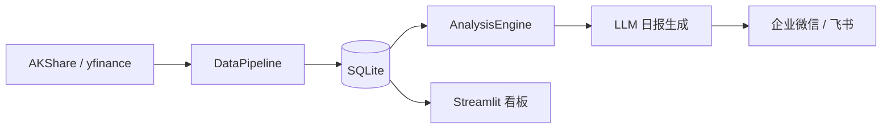

# Fund-Advisor

[](https://www.python.org/)
[](LICENSE)
[](https://github.com/astral-sh/uv)

个人基金/ETF 智能投顾日报系统。它面向个人投资组合，自动采集 A 股和全球市场数据，写入本地 SQLite，运行趋势、轮动、估值、风险分析，再用兼容 OpenAI Chat Completions 协议的 LLM 生成中文日报，并通过企业微信、飞书或 Streamlit 看板交付。

这个项目只生成分析和建议，不做自动下单。

## 当前能力

- A 股数据：通过 AKShare 采集 ETF 行情、主要指数、行业排名、资金流、估值、财经新闻。
- 全球数据：通过 yfinance 采集美股 ETF、全球指数、VIX、USD/CNY、美债收益率。
- 历史数据：支持 ETF 和指数 OHLCV 回填，用于均线、回撤、相关性等指标。
- 分析引擎：覆盖趋势、行业轮动、估值温度、异常波动、最大回撤和持仓盈亏。
- LLM 日报：生成“今日概览、方向信号、板块机会、估值温度、风险提醒、你的持仓”六段式报告。
- 多渠道交付：支持企业微信、飞书 webhook 推送，以及 Streamlit 本地看板。

## 系统数据流



详细架构图见 [docs/architecture.html](docs/architecture.html)。

## 快速开始

### 1. 安装依赖

```bash
git clone <repo-url>
cd fund-advisor
uv sync
```

### 2. 配置 `.env`

复制示例文件并填入本地密钥：

```bash
cp .env.example .env
```

LLM 的 provider、model、base URL、API key、temperature 和 max tokens 都在 `.env` 里配置。`.env` 会在 `load_config()` 时自动加载，且不会覆盖系统里已经导出的环境变量。

### 3. 配置持仓

编辑 [portfolio.yaml](portfolio.yaml)，填入你的 ETF 代码、成本价、份额和类别。

### 4. 初始化历史数据

第一次使用建议先回填历史数据：

```bash
uv run python -c "
from src.config import load_config
from src.data.collectors.akshare_collector import AKShareCollector
from src.data.collectors.yfinance_collector import YFinanceCollector
from src.data.pipeline import BackfillPipeline
from src.data.storage import MarketDB

cfg = load_config()
db = MarketDB(cfg.data.storage.path)
bp = BackfillPipeline(AKShareCollector(), YFinanceCollector(), db, cfg)
print(bp.run_backfill(days=365))
"
```

### 5. 运行

```bash
# 跑一次完整流程：采集 -> 分析 -> 日报 -> 输出；已启用 webhook 时会推送
uv run python main.py once

# 启动定时任务
uv run python main.py scheduler

# 启动 Web 看板
uv run streamlit run app.py
```

## LLM Provider 配置

LLM 客户端调用标准路径：

```text
{base_url}/chat/completions
```

只要供应商兼容 OpenAI Chat Completions 协议，就可以通过 `.env` 接入。`config/config.yaml` 只保留日报长度、语气等业务配置。

### OpenAI

```dotenv
LLM_PROVIDER=openai
LLM_MODEL=gpt-4o-mini
LLM_BASE_URL=https://api.openai.com/v1
LLM_API_KEY=sk-xxx
LLM_TEMPERATURE=0.7
LLM_MAX_TOKENS=4096
LLM_TIMEOUT_SECONDS=180
```

### SiliconFlow

```dotenv
LLM_PROVIDER=siliconflow
LLM_MODEL=Qwen/Qwen3-32B
LLM_BASE_URL=https://api.siliconflow.cn/v1
LLM_API_KEY=sk-xxx
LLM_TEMPERATURE=0.7
LLM_MAX_TOKENS=4096
LLM_TIMEOUT_SECONDS=180
```

### Moonshot

```dotenv
LLM_PROVIDER=moonshot
LLM_MODEL=moonshot-v1-8k
LLM_BASE_URL=https://api.moonshot.cn/v1
LLM_API_KEY=sk-xxx
LLM_TEMPERATURE=0.7
LLM_MAX_TOKENS=4096
```

### 本地 OpenAI-compatible 服务

```dotenv
LLM_PROVIDER=local
LLM_MODEL=qwen2.5:7b
LLM_BASE_URL=http://localhost:8000/v1
LLM_API_KEY=local
LLM_TEMPERATURE=0.7
LLM_MAX_TOKENS=4096
```

## 持仓配置

[portfolio.yaml](portfolio.yaml) 的基本格式：

```yaml
holdings:
  - code: "510300"
    name: "沪深300ETF"
    market: "a_share"
    cost_basis: 3.85
    shares: 5000
    category: "broad"

  - code: "QQQ"
    name: "纳指100ETF"
    market: "us"
    cost_basis: 420.0
    shares: 50
    category: "overseas"
```

字段说明：

| 字段 | 含义 |
| --- | --- |
| `code` | ETF 或指数代码 |
| `name` | 展示名称 |
| `market` | `a_share`、`us` 或 `hk` |
| `cost_basis` | 持仓成本价 |
| `shares` | 持有份额 |
| `category` | `broad`、`sector`、`theme`、`overseas`、`bond` |

## 常用命令

```bash
# 安装或同步依赖
uv sync

# 运行测试
uv run --extra dev pytest -q

# 语法检查
uv run python -m compileall -q src main.py app.py tests

# 运行一次日报流程
uv run python main.py once

# 启动调度
uv run python main.py scheduler

# 启动看板
uv run streamlit run app.py
```

## 配置文件

核心配置在 [config/config.yaml](config/config.yaml)：

```yaml
data:
  storage:
    type: sqlite
    path: data/fund_advisor.db

analysis:
  trend:
    ma_periods: [5, 20, 60]
    standing_line_threshold: 0.5
  risk:
    anomaly_threshold: 0.03
    max_drawdown_warning: 0.15
    correlation_warning: 0.8

notify:
  wechat_work:
    enabled: false
    webhook_url_env: WECHAT_WORK_WEBHOOK_URL
  feishu:
    enabled: false
    webhook_url_env: FEISHU_WEBHOOK_URL

llm:
  report:
    max_length_chars: 800
    tone: "专业简洁"
```

推送通道默认关闭。开启后需要在 `.env` 中设置对应 webhook 变量：

```bash
WECHAT_WORK_WEBHOOK_URL=https://qyapi.weixin.qq.com/cgi-bin/webhook/send?key=xxx
FEISHU_WEBHOOK_URL=https://open.feishu.cn/open-apis/bot/v2/hook/xxx
```

## 项目结构

```text
fund-advisor/
├── main.py                    # CLI 入口：once / scheduler
├── app.py                     # Streamlit 看板
├── config/config.yaml         # 系统配置
├── portfolio.yaml             # 持仓配置
├── src/
│   ├── config.py              # Pydantic 配置模型
│   ├── data/
│   │   ├── pipeline.py        # DataPipeline / BackfillPipeline
│   │   ├── storage.py         # SQLite 存储
│   │   ├── portfolio.py       # 持仓读取
│   │   ├── validation.py      # 数据质量校验
│   │   └── collectors/        # AKShare / yfinance / retry
│   ├── analysis/              # 趋势、轮动、估值、风险
│   ├── llm/                   # OpenAI-compatible 客户端和日报生成
│   ├── notify/                # 企业微信、飞书推送
│   ├── scheduler/             # APScheduler 任务
│   └── utils/                 # 日志和工具函数
├── tests/                     # 自动化测试
└── docs/                      # 架构图和设计文档
```

## 部署建议

### 本机或服务器后台运行

```bash
mkdir -p data/logs
nohup uv run python main.py scheduler > data/logs/scheduler.log 2>&1 &
nohup uv run streamlit run app.py --server.port 8501 > data/logs/streamlit.log 2>&1 &
```

### systemd 示例

```ini
[Unit]
Description=Fund Advisor Scheduler
After=network.target

[Service]
Type=simple
User=ubuntu
WorkingDirectory=/home/ubuntu/fund-advisor
ExecStart=/usr/local/bin/uv run python main.py scheduler
Restart=always
RestartSec=10
Environment=LLM_PROVIDER=openai
Environment=LLM_MODEL=gpt-4o-mini
Environment=LLM_BASE_URL=https://api.openai.com/v1
Environment=LLM_API_KEY=sk-xxx
Environment=LLM_TEMPERATURE=0.7
Environment=LLM_MAX_TOKENS=4096
Environment=WECHAT_WORK_WEBHOOK_URL=https://...

[Install]
WantedBy=multi-user.target
```

```bash
sudo systemctl enable fund-advisor
sudo systemctl start fund-advisor
sudo systemctl status fund-advisor
```

## 当前限制

- 依赖 AKShare 和 yfinance，外部数据源的可用性、字段变化和限流会影响采集结果。
- 系统只做分析和建议，不自动交易，不保证收益。
- LLM 日报只基于采集和分析结果生成；数据缺失时会降级为规则报告。
- 第一次运行前建议做历史回填，否则部分均线、回撤、相关性指标会缺少样本。

## 路线图

- 结构化 LLM 输出：用 Pydantic 校验日报 JSON，再渲染为文本。
- 更完整的风险面板：异常波动、回撤、相关性和持仓集中度。
- 更丰富的组合约束：仓位上限、定投规则、止盈止损提示。
- 回测能力：验证信号对历史组合的影响。
- 多智能体分析：引入正反观点辩论和信号集成。

## 设计文档

- [系统设计文档](docs/superpowers/specs/2026-05-09-fund-etf-advisory-system-design.md)
- [交互式架构图](docs/architecture.html)
- [金融 AI 生态参考](docs/fin-ai-ecosystem/README.md)

## License

MIT
